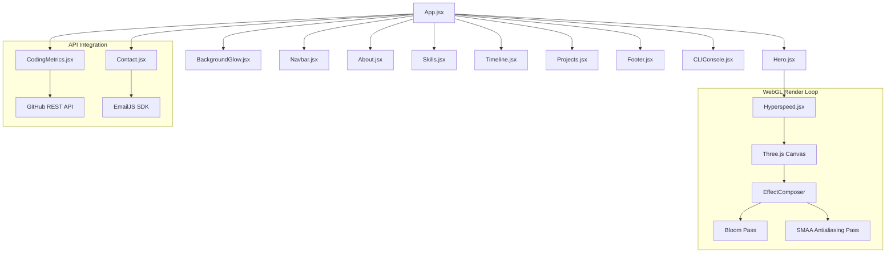

# 🏛️ System Architecture | Arpit Shirbhate Portfolio

This document provides a comprehensive overview of the architecture, component hierarchy, design systems, and rendering pipelines that power the developer portfolio.

---

## 🗺️ Architectural Overview

The portfolio is designed as an interactive, single-page application (SPA) built using **React 19**, **JavaScript (ES6+)**, and **Vite**. It features a glassmorphic dark-mode design system enriched with WebGL animations and an interactive CLI console emulator.



---

## 🛠️ Technology Stack

- **Framework**: React 19 (Functional components with Hooks)
- **Language**: JavaScript (ES6+ / JSX)
- **Styling**: Tailwind CSS v4 & PostCSS
- **Animations**: Framer Motion (for spring-physics transitions and scroll-reveals)
- **3D Graphics**: Three.js & Postprocessing (custom WebGL render pass)
- **Icons**: Lucide React
- **Bundler**: Vite 8 (configured for high-speed local loading and building)

---

## 📂 Component Directory Structure

All frontend modules are located in the `src/` directory:

```bash
src/
├── components/
│   ├── About.jsx            # Narrative section, metrics, and simulated IDE viewer
│   ├── BackgroundGlow.jsx   # Multi-layered radial glowing canvas spotlights
│   ├── CLIConsole.jsx       # Interactive developer CLI terminal (portal overlay)
│   ├── CodingMetrics.jsx    # Live GitHub API metrics & contribution calendar
│   ├── Contact.jsx          # Contact station with email validation and EmailJS
│   ├── Footer.jsx           # Section layout containing copyright and mapping markers
│   ├── Hero.jsx             # Hero landing section layout
│   ├── Hyperspeed.css       # Stylesheets for the Three.js corridor canvas
│   ├── Hyperspeed.jsx       # High-performance Three.js WebGL lights corridor
│   ├── Navbar.jsx           # Floating navigation bar with mobile drawer toggle
│   ├── Projects.jsx         # Symmetrical project grid with embedded architecture flows
│   ├── Skills.jsx           # Grid grouping core technology stacks
│   └── Timeline.jsx         # Symmetrically aligned vertical professional journey
├── App.jsx                  # Main application container and component orchestrator
├── index.css                # Global styles, fonts, and Tailwind variables
└── main.jsx                 # Application entry point mounting react root
```

---

## ⚙️ Core Subsystems

### 1. ⌨️ Developer CLI Console Emulator (`CLIConsole.jsx`)
An overlay command-line terminal simulated entirely in React state.
- **Trigger**: Toggleable via keyboard shortcut (Backtick key: ` `` ` ``) or navbar action button.
- **Commands**:
  - `help`: Lists actions.
  - `neofetch`: Prints ASCII system banner.
  - `about` / `skills` / `projects` / `contact` / `resume`: Outputs details about the developer.
  - `clear`: Empties the history state array.
- **ANSI Color Parser**: The terminal interprets basic ANSI color escape codes (e.g. `\x1b[32m` for green) dynamically in the frontend to style outputs like neofetch.

### 2. ⚡ WebGL Hyperspeed Corridor (`Hyperspeed.jsx`)
A high-performance real-time 3D animation utilizing Three.js and custom shaders:
- **Instance Buffers**: Efficiently renders hundreds of moving light tubes and side sticks using `InstancedBufferGeometry`.
- **Post-Processing pipeline**:
  - **EffectComposer**: Manages the post-processing stack.
  - **RenderPass**: Normal rendering stage of the scene.
  - **BloomEffect**: Generates the high-intensity glow representing data pipelines.
  - **SMAAEffect**: Standard subpixel morphological antialiasing to prevent jagged edges.
- **Distortion Shaders**: Custom vertex shader deformations (e.g. turbulent, mountain, or deep wave curves) dynamically warp the space corridor based on time uniforms.

### 3. 📊 GitHub Integration (`CodingMetrics.jsx`)
- **Live Feed**: Hits the GitHub REST API (`https://api.github.com/users/arpit2006`) on initial mount to fetch live repository counts.
- **Contribution Graph**: Embeds a styled SVG contribution tracker (`ghchart.rshah.org/10b981/arpit2006`) with horizontal overflow scrolling on mobile viewport resolutions.

### 4. 📐 System Flow Visualizers (`Projects.jsx`)
Each project features an expandable sub-grid displaying its software architecture or ML pipeline flow using structural nodes:
- **Prompt Craft**: User Input $\rightarrow$ Multi-LLM Optimizer $\rightarrow$ Output.
- **Popularity Tier Predictor**: API Query $\rightarrow$ XGBoost Classifier $\rightarrow$ Streamlit Dashboard.
- **Churn Predictor**: Demographic Data $\rightarrow$ Preprocessing/SMOTE $\rightarrow$ ROC-AUC/F1 Evaluation.

---

## 🚀 Deployment Pipeline

The project is configured for seamless deployment to **GitHub Pages**:
1. **Source Code Check**: Clean JavaScript ES6 modules linted with ESLint.
2. **Build**: Vite compiles the React project, outputting minified HTML, CSS, and JS chunks into `/dist`.
3. **CI/CD Workflow**: GitHub Action (`deploy.yml`) triggers on every push to `main` or `master` to fetch, install, compile, and upload `/dist` directly to the server environment.
